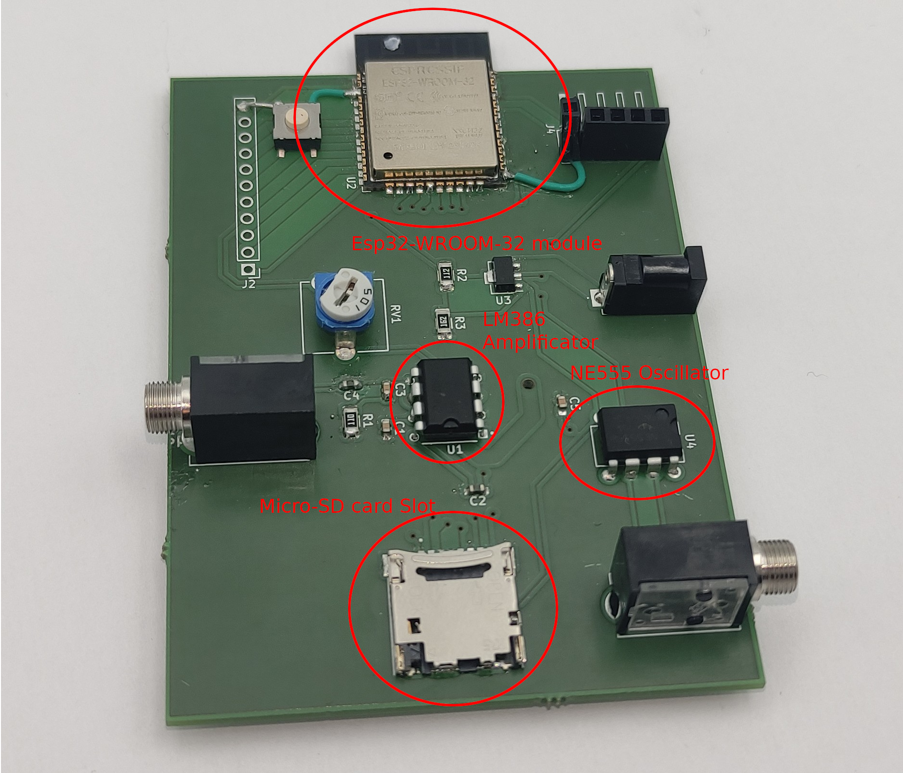

# ESP32 capacitive sensing project for [Musical Plant Interface](https://dvic.devinci.fr/projects/plant-based-interface)

This project is a proof of concept for a capacitive sensing interface for musical instruments. It is based on the [ESP32](https://www.espressif.com/en/products/socs/esp32) microcontroller. The ESP32 is a low-cost microcontroller with integrated WiFi and Bluetooth. It is a great platform for IoT projects.

The esp32 generate a web server to simplify the calibration. It will embed a SD card to store the calibration data.

The PCB can be found in [this repository](https://github.com/matthieu-sgi/NE555_Musical_Plant_Interface) or in `PCB/NE555_Musical_Plant_Interface` folder.

## How to use

The user guide instructions are given following the picture above. 

Plug the jack from the plant electrodes in the jack on the bottom right.

Plug the jack to the speaker int the middle left jack.

Plug the DC jack in the DC jack on the middle-top right.